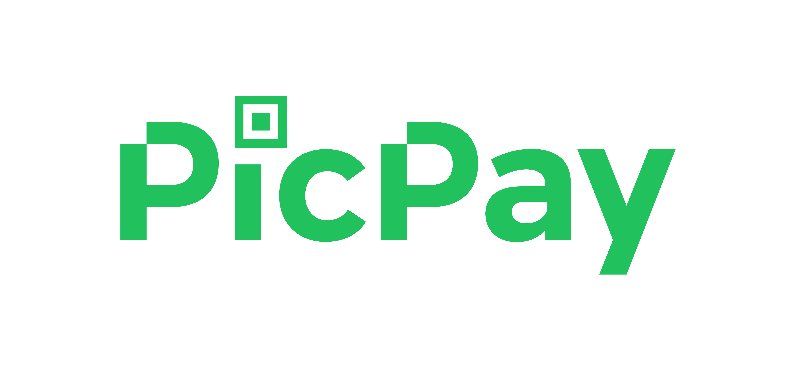

<h4 align="center">
    
    
</h4>

# Indice

- [Sobre](#-sobre)
- [Tecnologias Utilizadas](#-tecnologias-utilizadas)

## :bookmark: Sobre 

Com a finalidade de estudar React Native, cirei uma Clonagem da <b>interface</b> do aplicativo do <b>PicPay</b> a partir de um video.

---

## :rocket: Tecnologias Utilizadas

O projeto foi desenvolvido utilizando as seguintes tecnologias

- [React Native](https://reactnative.dev/)
- [React Navigation v5](https://reactnavigation.org/)
- [Expo](https://expo.io/)
- [Styled Components](https://styled-components.com/)

---

## :fire: Como usar

- Clone esse repositório: `git clone https://github.com/vitorserrano/picpay-clone.git`
- Instale as dependências: `npm install` 
- Start a aplicação: `npm start`

---

## :recycle: Como contribuir

- Faça um Fork desse repositório,
- Crie uma branch com a sua feature: `git checkout -b my-feature`
- Commit suas mudanças: `git commit -m 'feat: My new feature'`
- Push a sua branch: `git push origin my-feature`

---

## :mortar_board: Quem ministrou?

- As aulas foram ministradas pelo mestre [Mateus Silva](https://github.com/maateusilva) em videos no seu canal no youtube.

---

## :memo: License

Esse projeto está sob a licença MIT. Veja o arquivo [LICENSE](LICENSE) para mais detalhes.

